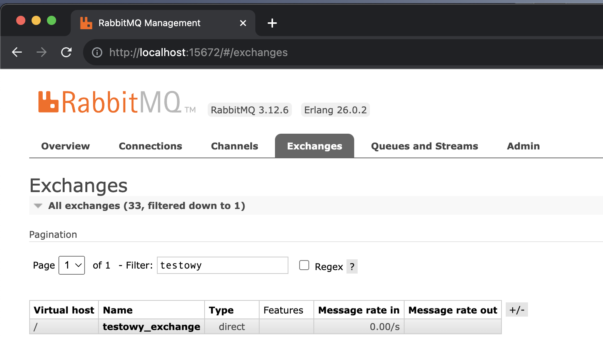
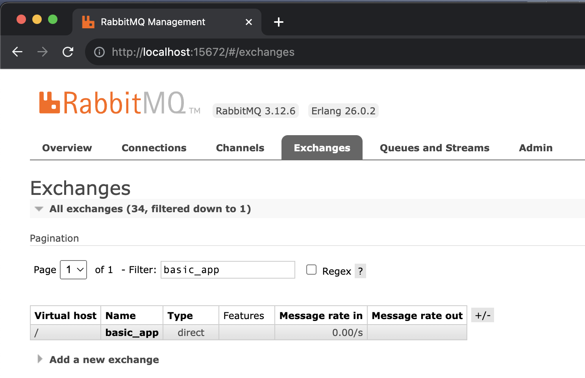
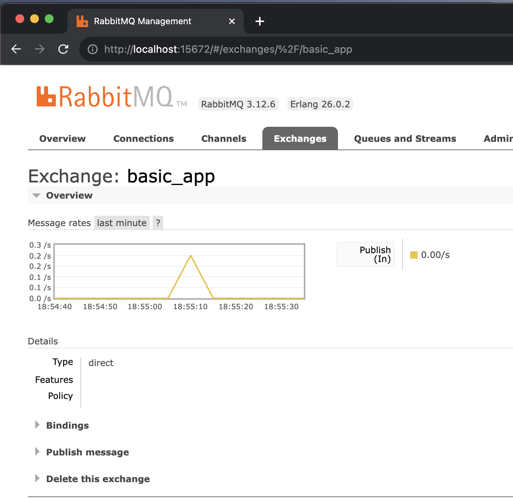
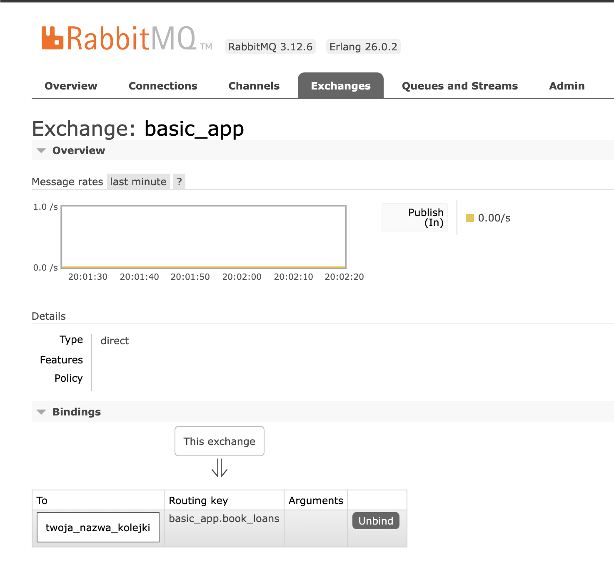
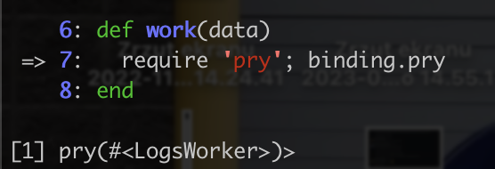
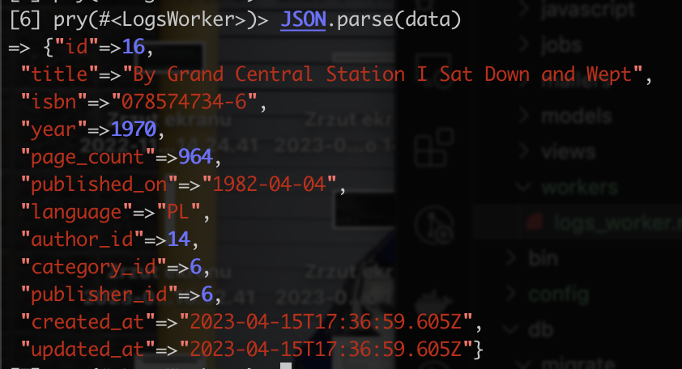
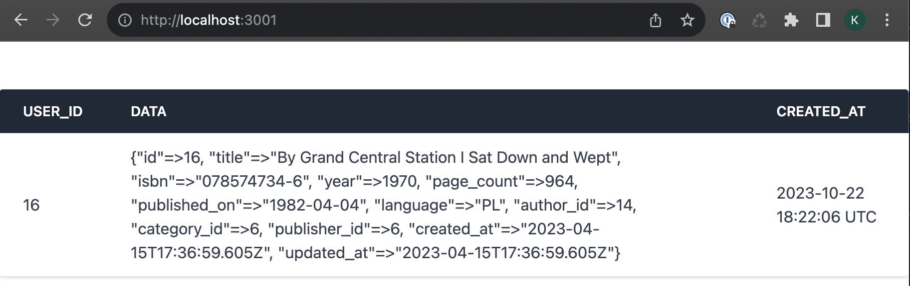

# Wysyłanie logów dotyczących działań użytkownika za pomocą systemu kolejkowania RabbitMQ

## Cel zadania

Chcemy zbierać w osobnej aplikacji zdarzenia/logi dotyczące akcji jakie wykonuje użytkownik korzystający z biblioteki (basic_app).

## Dwa etapy zadania

1. Publikowanie zdarzeń/logów do kolejki rabbitowej z basic_app
2. Konsumowanie wiadomości z kolejki i zapis zdarzeń w side_app

## Etap I - Basic App

## Instalcja RabbitMQ

To było na zadanie domowe ;) Jeśli ktoś nie zdążył to instrukcja poniżej.
https://github.com/infakt/workshops_2023_basic_app/blob/main/docs/install-rabbit.md

## Bunny - producent wiadomości

1. Do wysyłania zdarzeń do kolejki użyjemy gemu `bunny` -> https://github.com/ruby-amqp/bunny. Dodajemy go do naszego Gemfile: `gem 'bunny'` i uruchamiamy `bundle`.
2. Aby wysłać wiadomość, potrzebujemy najpierw połączyć się z RabbitMQ. W tym celu stworzymy nowy serwis.
Nazwijmy go `Application` i umieśćmy go w module `Publishers` -> `app/services/publishers/application.rb`. Powinien on być inicjalizowany trzema parametrami:
  - treścią wiadomości (to, co będziemy chcieli przekazać do drugiej apki)
  - nazwą exchange'a
  - kluczem (routing_key). 

  (zachęcam tutaj do użycia keyword parameters `AA.new(aa: 'aa', bb: 'bb')`)

  Pamiętajmy o `require 'bunny'` bez którego nie będziemy mogli użyć metod zawartych w tym gemie!

3. Stwórzmy kilka metod prywatnych, dla uporządkowania kodu:
  - *connection_options* -> zbiór informacji potrzebnych do połączenia z rabbitem
    ```
      {
        host: "localhost",
        port: "5672",
        vhost: "/",
        username: "guest",
        password: "guest"
      }
    ```
    (Dane dotyczące połączenia warto trzymać zaszyfrowane np. w plikach A9n. tutaj dla uproszczenia definiujemy je jawnie w kodzie)
    
   - *connection* -> Aby móc przesyłać wiadomości do naszego brokera musimy zdefiniować połączenie z nim
   przekazując odpowiednie opcje: `Bunny.new(connection_options)`. Pamiętajmy o memoizacji (`@connection ||=`), inaczej za każdym wywołaniem metody będziemy tworzyć kolejne połączenie, co może wywołać błąd
4. Główna metoda (publiczna) tego serwisu, z której będziemy korzystać powinna:
  - startować połączenie(`connection.start`),
  - Tworzyć *kanał* (`channel = connection.create_channel`)
  - Tworzyć bezpośredni *exchange* (`channel.direct()`), który w parametrze przyjmuje nazwę exchange'a z initializera. Tworzony exchange, warto przypisać do zmiennej, bo zaraz się nam przyda :)
  - Dla exchange'a publikować przekazaną z initalizera wiadomość w formacie JSON, na odpowiedni routing_key. `.publish(message.to_json, routing_key: routing_key)`
  - Zamknąć połączenie `connection.close`
  (przydatny link, `https://www.rabbitmq.com/tutorials/tutorial-one-ruby.html`)
Na tym etapie możemy sprawdzić czy poprawnie łączymy się z rabitem. W konsoli railsowej możemy zawołać:
```
::Publishers::Application.new(
     routing_key: 'testowy_routing_key',
     exchange_name: 'testowy_exchange',
     message: { test: 'test' }
).perform
```
W konsoli powinniśmy dostać true, a w panelu na http://localhost:15672/#/exchanges powinen pojawić się `testowy_exchange`.



5. A teraz KONKRETY! 

Chcielibyśmy logować informacje dotyczące wypożyczenia książki. W tym celu stworzymy nowy publisher `Publishers::LoanBookPublisher` w katalogu `/services/publishers`.
  - publisher przyjmuje w initializerze treść wiadomości.
  - powinen mieć metodę publiczną, która wykorzystuje nasz `Publishers::Application.new(...`.
  - `Publishers::Application` będzie potrzebował do poprawnego wykonania, 
      - `message`, który przekazujemy z initializera,
      - `exchange_name`
      - `routing_key`
  - UWAGA! Tutaj musimy zdefiniować na jaki exchange i routing key będziemy wysyłać wiadomość. Te nazwy będą nam jeszcze dziś potrzebne! :)
  - Na koniec pamiętajmy o zawołaniu metody publicznej.
  Ciało metody, która opublikuje wiadomość do RabbitMQ **może** wyglądać mniej więcej tak:
```
  def publish
    ::Publishers::Application.new(
      routing_key: 'basic_app.book_loans',
      exchange_name: 'basic_app',
      message: message
    ).perform
  end
```
6. Ostatnim krokiem jest wpięcie naszego LoanBookPublishera w odpowiednie miejsce w kontrolerze odpowiedzialbym za wypożyczenie ksiąki i przekazanie danych.Publikowanie logu warto wpiąć w miejsce, gdzie wiemy, że nasze wypożyczenie na pewno zapisało się do bazy.Jeśli chodzi o dane to przesyłajmy do Publishera wszystkie dotyczące wypożczenia. Wykorzystamy metodę `.attributes`.

Aby sprawdzić, czy poprawnie działa nam cały kod dotychczasowy kod.
Wypożyczamy książke, wchodzimy na http://localhost:15672/#/exchanges, tam powinen być stworzony exchange o nazwie, którą zdefiniowaliśmy w LoanBookPublisherze



Jeśli chcemy mieć pewność, że wiadomość została faktycznie opublikowana na danym exchangeu, to możemy kliknąć jego nazwę wtedy zobaczymy wykres aktywności.



## Etap II - Side APP
## Setup Side APP
Aby przyśpieszyć trochę pracę przygotowałem Aplikację, której zadaniem będzie odbieranie logów.
1. Forkujemy repozytorium z https://github.com/infakt/workshops_2023_side_app
2. Instalujemy gemy: `bundle install`
3. Setupujemy bazę: `rake db:setup`
4. Uruchamiamy server: `rails server`
Aplikacja powinna uruchomić się na porcie 3001. `http://localhost:3001/`
Jeśli chcemy potwierdzić czy logi wyświetlają się prawidłowo, tworzymy w konosli railsowej obiekt:
`Log.create(user_id: 1, data: {ff: 'aaa'})`, który po teście możemy usunąć.

## Setup gemów Sneakers i Bunny
1. Dodajemy gem Sneakers odpowiadający za tworzenie workerów konsumujących wiadomości. Do Gemfile dodajemy `gem 'sneakers'` oraz `gem 'bunny'` - odpowiedzialny za połączenie z RabbitMQ.
2. Instalujemy gemy: `bundle install`.
3. Potrzebujemy stworzyć plik inicjalizujący `config/initializers/sneakers.rb`. W nim łączymy Sneakersa z RabbitMQ, przy pomocy Bunny, a jak?
Stwórzmy zmienną, która będzie zawierała opcje połączenia:
    ```
    bunny_connection_options = {
      host: "localhost",
      port: "5672",
      vhost: "/",
      username: "guest",
      password: "guest"
    }
    ```
  tą zmienną przekazujemy jako połączenie do konfiguracji Sneakersa
  ```
  Sneakers.configure(
    connection: Bunny.new(bunny_connection_options),
    durable: false,
    workers: 1
  )
  ```
  Ustawiamy liczbę workerów 1, bo na ten moment nie potrzebujemy więcej ;)
  Pamiętajmy, aby dodać na początku pliku `require 'sneakers'`, aby móc korzystać z metod zawartych w gemie.

  4. Naszym głównym celem po stronie aplikacji jest stworzenie workera, który skonsumuje wiadomość z kolejki z logiem i zapisze dane dotyczące wypożyczenia w side_app.
  Tworzymy `LogsWorker` w katalogu workers. `app/workers/logs_worker.rb`
  Worker musi include'ować metody z `Sneakers::Worker`.
  Następnie definiujemy z jakiej kolejki Worker ma pobierać wiadomości.
  Korzystamy z metody `from_queue`. Jako argumenty przyjmuje ona:
  - nazwę kolejki,
  - exchange,
  - exchange_type,
  - routing_key
  Przykładowe wywołanie
  ```
    from_queue 'twoja_nazwa_kolejki', exchange: 'twoja_nazwa_exchangea', exchange_type: :direct, routing_key: 'twoj_routing_key'
  ```
UWAGA! Tutaj chcemy wykorzystać **exchange** i **routing_key**, które wcześniej zdefiniowaliśmy w Producencie.
Czas na test!

5. W naszym `Rakefile` musimy dodać linijkę `require 'sneakers/tasks'` inaczej Sneakers nie znajdzie naszego workera.
Teraz w nowym oknie w terminalu urchamiamy komendę `bundle exec rake sneakers:run`.
Jeśli sneakers uruchomi się poprawnie to wchodząc na pannel RabbitMQ sprawdzimy, czy nasza kolejka poprawnie podpięła się pod exchange.
http://localhost:15672/#/exchanges -> wybieramy z listy nasz exchange i sprawdzamy w zakładkce `Bindings` czy jest tam nasza kolejka.
Jeśli nie to wołamy o pomoc! :D



## Zapis logów w bazie i debugowanie
1. Ostatnim krokiem jest zapisanie naszego logu w bazie danych side_app.

Sprawdźmy jak wygląda nasza wiadomość, gdy odbierze ją LogsWorker.
W tym celu wykorzystamy gem do debugowania `pry`.
Instalujemy go w naszym gemfile najlepiej w grupie development. `gem 'pry'` -> `bundle install`

W naszym `LogsWorker` powinniśmy mieć pustą metodę work, która przyjmuje w argumencie message. W tej metodzie dodajemy wywyłanie pry'a.
Metod powinna wyglądać to mniej więcej tak: (nazwa `work` jest konieczna!)
```
  def work(data)
    binding.pry
  end
```
UWAGA! 
Po każdej zmianie kodu w workerze, należy zrestartować serwer.


Przechodzimy do Bilbioteki i wypożyczamy książkę. Z pozoru nic się nie wydarzyło, ale serwer side_app powinen zatrzymać się na wykonaniu metody `work`. 



Wpisując `data` (opieram się na nazwach z przykłądu wyżej) powinniśmy dostać nasz message.
Jest on w formacje JSON. Aby zapisać dane potrzebujemy go sparsować do Hasha. Możemy przetestować parsowanie w naszej 'sesji' debuggera/pry'a.



Mamy już wszystkie potrzebne dane. Aby serwer zaczął działać dalej musimy zakończyć pracę debbugera. Wpisujemy 'next' lub kombinacje klawiszy CTRL+D.
Wracamy do naszej metody. Usuwamy `pry`, a do zmiennej przypisujemy sparsowany JSON.

W side_app mamy już wygenerowany Log -> `app/models/log.rb`. Wymaga on dwóch pól `user_id` i `data`.
Docelowo chcemy, żeby nasz worker zapisał w bazie danych Log z danymi, które otrzymał. Możemy wykorzystać do tego zapis, którego użyliśmy w Setupie side_app, przekazując odpowiednie dane. Całość na koniec powinna wyglądać tak:




  ## Zadania dodatkowe
  1. Wyniesienie do a9n(config/configuration.yml) opcji połączenie (connection_options) w base_app i side_app.
  2. Wysyłanie Logu o przerwaniu wypożyczenia. Ten sam exchange, ta sama kolejka inny routing key.
  3. Pokazywanie w SideApp typu akcji na podstawie routing key. Potrzebna Migracja po stronie side_app lub dorzucenie klucza do `data`
  4. Wystawienie końcówki API w SideApp, tak, żeby BasicApp mógł pobrać listę wszystkich wydarzeń dla uzytkownika
  
